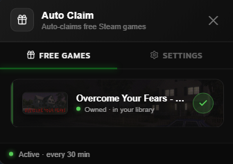

# Auto Claim

A Millennium plugin that automatically grabs every 100% off game on the Steam Store and adds it to your library — silently, in the background.

## Features ✨

The plugin adds a **side-tab button** on the Steam storefront, vertically centered on the screen. Click the arrow to slide open the Auto Claim panel with the list of free games. You can customize the button color, side, style and overlay behavior in **Steam menu → Millennium Library Manager → Plugin Settings → Auto Claim**.

- Scans the Steam Store every N minutes for 100% off games
- Silently adds free games to your library — no visible store page in 95% of cases
- Toast notification for every successful grab
- Skips DLCs, soundtracks and skin packs automatically
- Survives account switches — auto-detects stale cookies and re-captures them
- Configurable scan interval — 30, 60, or 120 minutes
- Auto-add or notify-only mode
- Enabled by default, no setup required

## Prerequisites

- [Millennium](https://steambrew.app)
