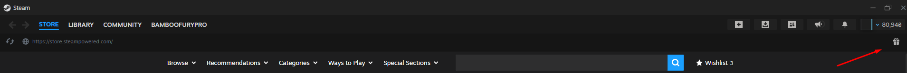

<h1 align="center">
  
  Auto Claim
</h1>

Automatically detects and claims every <b>100% discounted Steam game</b> directly to your library - silently, in the background, without interrupting your gameplay.

  
  
  
  

  

##  Features

<table>
  <tr>
    <td> <b>Automatic Detection</b> - scans the Steam Store for newly available 100% off games</td>
    <td> <b>Silent Claiming</b> - games are claimed in the background, no browser windows</td>
  </tr>
  <tr>
    <td> <b>Notifications</b> - toast after each successful claim</td>
    <td> <b>Smart Filtering</b> - skips DLCs, soundtracks, demos and skin packs</td>
  </tr>
  <tr>
    <td> <b>Store Widget</b> - live panel right on the Steam Store page, works with the default theme</td>
    <td> <b>Free Weekends</b> - see what's playable for free right now</td>
  </tr>
  <tr>
    <td> <b>Multi-Account Support</b> - picks up account switches automatically</td>
    <td> <b>Scheduled Scanning</b> - every 30 / 120 minutes or once a day</td>
  </tr>
  <tr>
    <td> <b>Flexible Modes</b> - Auto Claim or Notification Only</td>
    <td> <b>Customizable Widget</b> - colors, position, button style</td>
  </tr>
</table>
##  How It Works

1.  Auto Claim periodically scans the Steam Store (plus extra giveaway sources) for games with a 100% discount
2.  Every hit is verified against the official Steam API - only real, fully free games pass the filter
3.  The game is claimed silently in the background and appears in your library seconds later
4.  You get a notification - keep playing, nothing ever pops up over your game

##  Installation

> Requires [Millennium](https://steambrew.app) to be installed first.

1.  Open the Steam Menu
2.  Go to **Millennium**
3.  Choose **Install the plugin**
4.  Insert the plugin ID
5.  Restart Steam - done!

`Steam Menu → Millennium Library Manager → Auto Claim`

 Background Overlay - ON | OFF 
 Button Color - Presets 
 Accent Color - Presets 
 Indicator Color - Presets 
 Panel Side - Left | Right 
 Button Style - Slim | Large | Floating 
 Reset Widget Settings

`Store Widget → gear icon (Settings tab)`

 Auto-add to Library - ON | OFF 
 Notify on Grab - ON | OFF 
 Hide Owned Games - ON | OFF 
 Scan Interval - 30 min | 120 min | 1 day 
 Scan Now - run a check immediately

##  FAQ

**Will it claim DLCs and soundtracks?**
No, those are filtered out automatically. Only full games reach your library.

**Can it get my account banned?**
Auto Claim only adds free games to your library the same way the store button does - no purchases, no trades, no third-party logins.

**I switched accounts, do I need to restart?**
No, the plugin detects account changes and rescans automatically.

##  License

MIT - see [LICENSE](LICENSE). Not affiliated with Valve or Steam.

  Made for <a href="https://steambrew.app">Millennium</a> with 💕

