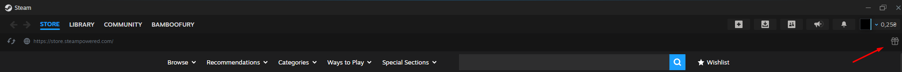

<h1 align="center">Auto Claim</h1>

  Every 100% discount and free game on Steam, claimed for you. 
  The plugin watches the store - you just open your library.

  
  
  
  

  

---

## Features

- **Automatic claiming** - 100% discounted games are added to your library without you opening the store
- **Three sources** - store discounts, Steam free weekends and GamerPower giveaways are all watched
- **Gift button** - a small gift icon on the toolbar shows everything that was found, ready to grab
- **Progress on game cards** - claiming shows its progress right on the game card, ownership updates in real time
- **Smart filtering** - choose what to watch: paid games only, everything, or free weekends only
- **Notifications** - a toast appears when a new game is grabbed, nothing silent or scary
- **Runs on schedule** - background scans every 30 minutes, every 2 hours or once a day, your choice
- **Nothing is ever lost** - every claimed game is remembered, so nothing is claimed twice
- **Localized** - the interface follows your Steam language: English, Russian, French, German, Italian, Polish, Spanish, Chinese, Japanese, Ukrainian

## Installation

1. Install [Millennium](https://steambrew.app)
2. Open **Millennium** in the Steam menu
3. Install **Auto Claim** from the plugin store, or download `auto-claim.star` from [Releases](https://github.com/BambooFury/Auto-Claim/releases) and drop it into `<Steam>/millennium/plugins/`
4. Restart Steam

## How it works

1. The plugin scans the store in the background - Steam discounts, free weekends and giveaways
2. Every new 100% deal is detected and, if **Auto Add** is on, claimed to your library instantly
3. The toolbar gift icon fills in as games are found and claimed
4. Claimed games are cached locally, so each one is only ever processed once

## The gift button

The toolbar gets a small gift icon at the end of the URL bar. It opens a panel where you can:

- **See everything found** - every detected deal with its discount and status
- **Claim manually** - grab any game with one click if auto add is off
- **Open in library** - jump straight to any game you already own
- **Control scanning** - start a scan right now instead of waiting for the schedule

## Settings

- **Auto Add** - claim games automatically or review them first
- **Scan interval** - every 30 minutes, every 2 hours or once a day
- **Filter mode** - paid games, everything, or free weekends only
- **Notifications** - toast for every grabbed game
- **Hide owned** - keep your library out of the found list

Everything is stored locally in `<Steam>/millennium/plugins/auto-claim-data/` - your account credentials are never saved anywhere.

## FAQ

**Does it slow down Steam?**

No. Scans run in the background on a schedule and results are cached after the first check.

**Is it safe?**

It uses your current Steam session inside your own client and only adds games that are 100% free. No passwords, no tokens, nothing leaves your machine.

**A game was claimed twice?**

Never. Every claimed game is remembered in the local cache - the same deal is never processed twice.

**Can I review games before they are claimed?**

Yes - turn **Auto Add** off and claim everything yourself from the gift button panel.

## License

MIT - see [LICENSE](LICENSE). Not affiliated with Valve or Steam.

  Made for <a href="https://steambrew.app">Millennium</a>

